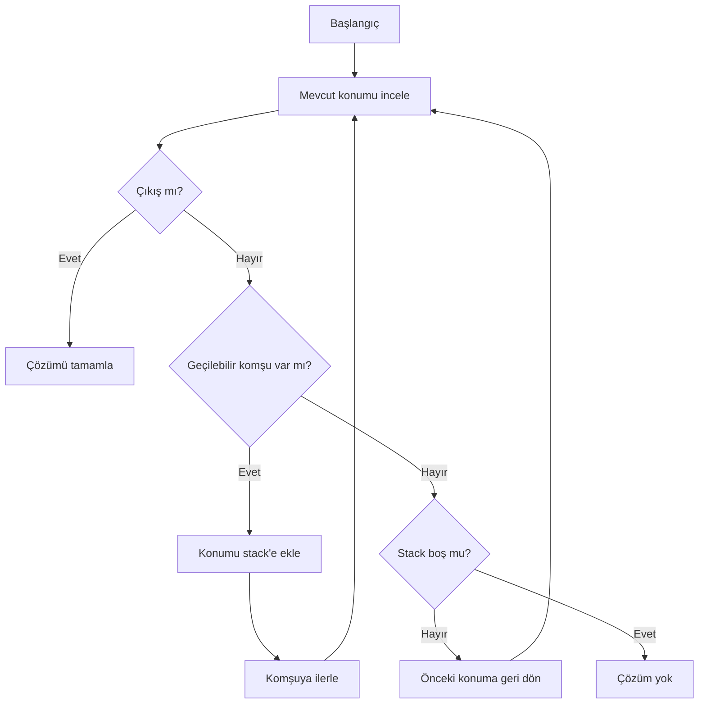

# Labirent Oyunu — Backtracking

20 × 50 karakterlik bir metin haritasında çıkış yolunu, özel bir yığın (`stack`) veri yapısı ve geri izleme (`backtracking`) yaklaşımıyla bulan C++17 konsol uygulaması.

## Algoritma

Program giriş hücresinden başlayarak geçilebilir komşuları araştırır. Bir sonraki konum yığına eklenir; çıkmaz sokağa ulaşıldığında son konum yığından çıkarılarak önceki karar noktasına dönülür ve alternatif yön denenir.



Harita gösteriminde `#` karakterleri duvarları, boşluklar ise geçilebilir alanları temsil eder. Arama süreci terminalde adım adım gösterilir.

## Neden özel stack?

Backtracking sırasında algoritmanın daha önce ziyaret ettiği karar noktalarına LIFO sırasıyla geri dönmesi gerekir. Projede hazır bir container kullanmak yerine yığın veri yapısı ayrıca uygulanarak veri yapısı ile algoritmanın ilişkisi görünür hale getirilmiştir.

## Derleme ve çalıştırma

Gereksinimler: C++17 destekli bir derleyici ve `make`.

```bash
make
make run
```

Derleme çıktılarını kaldırmak için:

```bash
make clean
```

## Proje yapısı

```text
.
├── Harita.txt
├── include/
│   ├── Konum.hpp
│   ├── Labirent.hpp
│   └── Stack.hpp
├── src/
│   ├── Konum.cpp
│   ├── Labirent.cpp
│   └── Test.cpp
└── makefile
```

`bin/` ve `lib/` klasörleri derleme sırasında oluşturulur; üretilen çalıştırılabilir dosyalar ve nesne dosyaları repoya eklenmez.

## Teknik notlar

- Harita boyutu ve başlangıç/bitiş koordinatları çalıştırma sırasında doğrulanır.
- Harita dışındaki koordinatlar engel kabul edilir.
- Dosya ve bellek yönetimi RAII ilkelerine uygun biçimde yapılır.
- Platforma özel Windows başlıkları veya kabuk komutları kullanılmaz.

## Karmaşıklık

`R × C` boyutlu bir labirentte her geçilebilir hücre kontrollü biçimde ziyaret edildiğinde arama maliyeti `O(R × C)` mertebesindedir. Ziyaret/geri dönüş durumlarını saklamak için kullanılan ek bellek de en kötü durumda `O(R × C)` olabilir.

## Sınırlılıklar

Bu proje en kısa yolu garanti eden bir yol bulma sistemi değil, backtracking ve özel stack kullanımını göstermek amacıyla hazırlanmış bir algoritma uygulamasıdır. Daha ileri bir sürümde BFS/A* ile en kısa yol karşılaştırması ve otomatik test haritaları eklenebilir.

## Lisans

Bu depo eğitim ve portföy amacıyla paylaşılmıştır.
